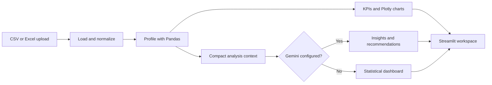

# AI Campus Data Analyst

<p align="center">
	<strong>Turn campus records into decisions, not spreadsheets.</strong><br>
	Upload a CSV or Excel file. Get the signal in seconds.
</p>

<p align="center">
	
	
	
	
</p>

<p align="center">
	<a href="#quick-start">Quick start</a> ·
	<a href="#what-it-does">Capabilities</a> ·
	<a href="#ask-the-data">Ask the data</a> ·
	<a href="#current-status">Status</a> ·
	<a href="#project-layout">Project layout</a>
</p>

> **Project status: working hackathon MVP**
>
> The current `main` branch contains the Streamlit dashboard, sample dataset, deterministic KPI and chart pipeline, optional Gemini insights, and a first set of natural-language query patterns.

## The idea

Campus teams already have the data. The hard part is finding the few patterns that deserve attention: a department falling behind on placements, students drifting into a risk zone, or a relationship between attendance and outcomes.

**AI Campus Data Analyst** is a focused Streamlit workspace for exactly that job. It profiles uploaded data, calculates transparent KPIs, builds useful charts, and adds an optional Gemini interpretation layer for summaries, recommendations, and questions in plain English.

> **Pandas calculates. Gemini interprets.**
>
> Numerical answers come from deterministic Python calculations first. The AI layer explains those results instead of inventing its own numbers.

## What it does

| Workspace | What you get |
| --- | --- |
| **Dataset overview** | Row count, column count, missing values, duplicates, and a preview of the data |
| **KPI radar** | Total students, average CGPA, attendance, placement rate, salary, internship rate, and at-risk students when matching columns exist |
| **Visual analytics** | Department comparisons, distributions, salary views, CGPA vs attendance, and a correlation heatmap |
| **AI briefing** | Executive summary, prioritized findings, anomalies, risk factors, and actionable recommendations |
| **Ask the Data** | Natural-language questions grounded in the uploaded dataset and computed results |

## Current status

### Available now

- CSV, XLSX, and XLS upload with empty-file and read-error handling
- Automatic column normalization, profiling, missing-value counts, duplicate counts, and data preview
- Conditional KPI generation based on available columns
- Local Plotly charts for department comparisons, distributions, salary, attendance, CGPA, and correlations
- Optional Gemini executive summary, findings, and recommendations from a compact analysis context
- Gemini-assisted explanations for supported questions such as rankings, department comparisons, risk counts, salary, attendance, and CGPA

### Known boundaries

- Gemini features require `GEMINI_API_KEY`; the statistical dashboard works without it
- The current query router supports common campus-analysis patterns rather than arbitrary dataframe operations
- Unmatched questions use a generic Gemini prompt and should be treated as exploratory, not as a verified calculation
- Chart and KPI detection depends on recognizable column names and compatible values
- The current MVP does not yet include date-aware analysis, custom chart building, export buttons, authentication, or persistent storage

The workflow document in the parent directory describes the broader target architecture. This README documents the implementation that is currently in the repository.

## Quick start

### 1. Install

```bash
git clone <your-repository-url>
cd campus-ai

python3 -m venv .venv
source .venv/bin/activate          # Windows: .venv\Scripts\activate
pip install -r requirements.txt
```

### 2. Optional: enable Gemini

The dashboard and statistical analysis work without an API key. Add one to unlock AI insights and **Ask the Data**:

```bash
cp .env.example .env
```

Then set the value in `.env`:

```env
GEMINI_API_KEY=your_api_key_here
```

Keep `.env` private. Never commit API keys.

### 3. Launch

```bash
streamlit run app.py
```

Open the local URL shown by Streamlit, upload a `.csv`, `.xlsx`, or `.xls` file, or choose **Use sample data** for an instant demo.

## Ask the Data

Once Gemini is configured, try questions such as:

```text
Which department has the highest placement rate?
Compare CSE and ECE.
How many students are at risk?
Which students have low attendance and low CGPA?
Show me the top 10 students by CGPA.
What is the average salary by department?
```

For supported question patterns, the app calculates the result with Pandas first and asks Gemini to explain that result. If Gemini is not configured, the app reports that AI features are unavailable. Questions outside the current router fall back to a generic Gemini response and are not guaranteed to be dataset-grounded.

## Bring your own dataset

The analyzer works best with descriptive column names. KPI and chart detection is automatic, so columns are optional rather than mandatory.

| Column | Enables |
| --- | --- |
| `Student_ID` | Student-level identification |
| `Department` | Department comparisons |
| `CGPA` | CGPA KPI, distribution, ranking, and risk detection |
| `Attendance` | Attendance KPI, distribution, and risk detection |
| `Internship` | Internship rate (`Yes`, `True`, or `1`) |
| `Placement` | Placement rate and department comparison |
| `Salary` | Average salary and salary distribution; zero values are excluded |

Column names are normalized on load by stripping whitespace, replacing spaces with underscores, and title-casing names. The sample file at [`sample_data.csv`](sample_data.csv) is ready for a first run.

## How it works



The app deliberately keeps the architecture small: no database, vector store, RAG pipeline, or separate frontend is required for this structured-data workflow.

## Technology

| Layer | Choice |
| --- | --- |
| Interface | Streamlit |
| Data loading and calculations | Pandas |
| Excel support | OpenPyXL |
| Interactive charts | Plotly Express |
| AI interpretation | Google Gemini via `google-genai` |
| Configuration | `python-dotenv` |

## Project layout

```text
campus-ai/
├── app.py              # Streamlit application and analysis pipeline
├── sample_data.csv     # Ready-to-run campus dataset
├── requirements.txt    # Python dependencies
├── .env.example        # Gemini configuration template
└── README.md           # This guide
```

## Troubleshooting

**The app opens but AI sections are unavailable**

Check that `.env` exists beside `app.py`, contains `GEMINI_API_KEY`, and that the key is valid. The non-AI dashboard remains available.

**A question receives a generic answer**

Use one of the supported patterns in the examples above. The current MVP does not yet translate every natural-language request into a Pandas operation.

**My file will not load**

Confirm that it is a readable CSV or Excel workbook and that it contains at least one row. The uploader accepts `.csv`, `.xlsx`, and `.xls` files.

**A KPI or chart is missing**

That usually means the corresponding column is not present, is named differently, or contains values that cannot be interpreted as expected. Start with the sample schema above.

## License

Add the project license here before public distribution.
