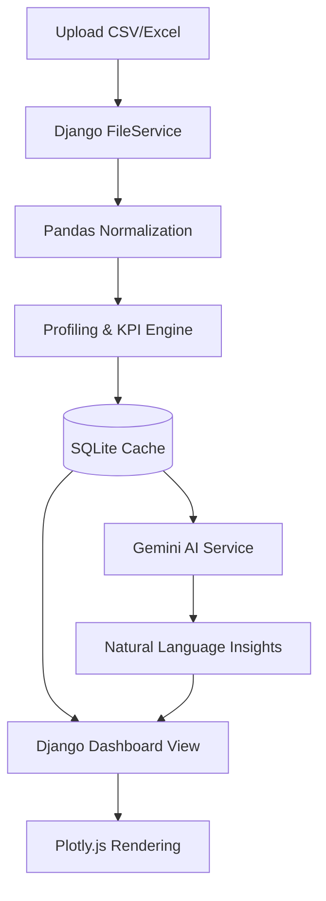

# 🎓 AI Campus Data Analyst
<p align="center">
  <strong>Transforming campus records into strategic decisions.</strong><br>
  Empowering educational institutions to uncover hidden patterns, identify at-risk students, and optimize placement outcomes using deterministic data analysis and Generative AI.
</p>

<p align="center">
  
  
  
  
  
</p>

<p align="center">
  <a href="#🚀-key-capabilities">Capabilities</a> · 
  <a href="#🛠️-architecture">Architecture</a> · 
  <a href="#⚡-quick-start">Quick Start</a> · 
  <a href="#💬-ask-the-data">Ask the Data</a>
</p>

---

## 🎯 The Vision

Campus administrators are often buried in spreadsheets. The real challenge isn't collecting data—it's extracting the **signal from the noise**. 

**AI Campus Data Analyst** bridges the gap between raw data and actionable intelligence. By combining the mathematical precision of **Pandas** with the interpretative power of **Google Gemini**, it turns static rows into executive briefings.

> **Deterministic Calculation $\rightarrow$ AI Interpretation**
> We don't let the AI guess numbers. Pandas calculates the truth; Gemini explains the meaning.

---

## 🚀 Key Capabilities

| 📊 Dataset Profiling | 📈 KPI Radar | 🎨 Visual Analytics | 🤖 AI Intelligence |
| :--- | :--- | :--- | :--- |
| Instant analysis of row/column counts, missing values, and data quality metrics. | Automated tracking of CGPA, Attendance, Placement Rates, and Salary trends. | Interactive Plotly dashboards showing distributions and correlations. | Structured executive summaries and prioritized risk factor detection. |

### 💬 Ask the Data
Stop writing complex filters. Just ask your data in plain English:
- *"Which department has the highest placement rate?"*
- *"Identify students with low attendance but high CGPA."*
- *"Compare the placement success of CSE vs ECE."*

---

## 🛠️ Architecture

The project has evolved from a prototype into a robust **Django Web Application**, ensuring scalability and persistence.

### Technical Stack
- **Backend**: Django 6.1 (MVC Architecture)
- **Data Engine**: Pandas & OpenPyXL
- **Visuals**: Plotly.js (Client-side rendering for high performance)
- **AI**: Google Gemini 3.5 Flash-Lite via `google-genai`
- **Database**: SQLite (with JSONField caching for analysis results)

### The Workflow


---

## ⚡ Quick Start

### 1. Installation
```bash
git clone <your-repository-url>
cd campus_analyst

# Setup virtual environment
python3 -m venv .venv
source .venv/bin/activate          # Windows: .venv\Scripts\activate
pip install -r requirements.txt
```

### 2. Configuration
Create a `.env` file in the root directory:
```env
GEMINI_API_KEY=your_google_gemini_api_key_here
```

### 3. Launch
```bash
python manage.py migrate
python manage.py runserver
```
Navigate to `http://127.0.0.1:8000` to start analyzing.

---

## 📂 Project Layout
```text
.
├── campus_analyst/    # Project configuration & settings
├── analyst/           # Core app (Models, Views, Services)
│   ├── services.py    # Business logic (The 'Brain' of the app)
│   └── models.py     # Data persistence layer
├── templates/         # Bootstrap 5 HTML templates
├── static/            # CSS & JS assets
├── media/             # Uploaded dataset storage
├── data/              # Sample datasets for testing
└── requirements.txt   # Python dependencies
```

---

## 🛡️ Data Schema Recommendations
For best results, ensure your dataset contains columns similar to:
- `Department` $\rightarrow$ For departmental comparisons.
- `CGPA` $\rightarrow$ For academic performance tracking.
- `Attendance` $\rightarrow$ For risk detection.
- `Placement` $\rightarrow$ For success rate analysis.
- `Salary` $\rightarrow$ For financial outcome tracking.

---

## 📜 License
This project is developed for the TCS Hackathon. Please refer to the project's LICENSE file for distribution terms.
